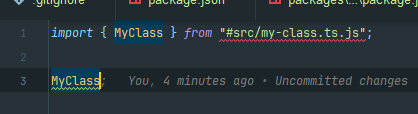
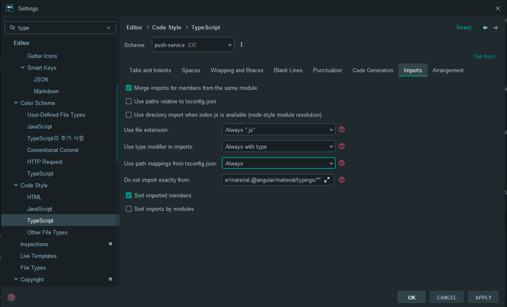

# WEBSTORM BUG REPORT 3

Wrong import path when using subpath import with auto import completion.

# Current Behavior

When using auto import completion in a file, the import path is wrong when using subpath import.

# Expected Behavior

import path should be created as `#src/my-class.js` instead of `#src/my-class.ts.js`

# Steps to Reproduce

1. Clone repository for reproduce
   - `git clone https://github.com/ChoSeoHwan/webstorm-bug-report-3.git`
2. Initialize the project
   - `yarn install`
3. Open `packages/my-test/src/index.ts` file.
4. Try to import `MyClass` using auto import completion.

# Environment

- OS : Windows 10
- WebStorm version: WebStorm 2024.1.4 Build #WS-241.17890.13, built on June 5, 2024
- Node version : v20.12.2
- Typescript code setting :
   - 
